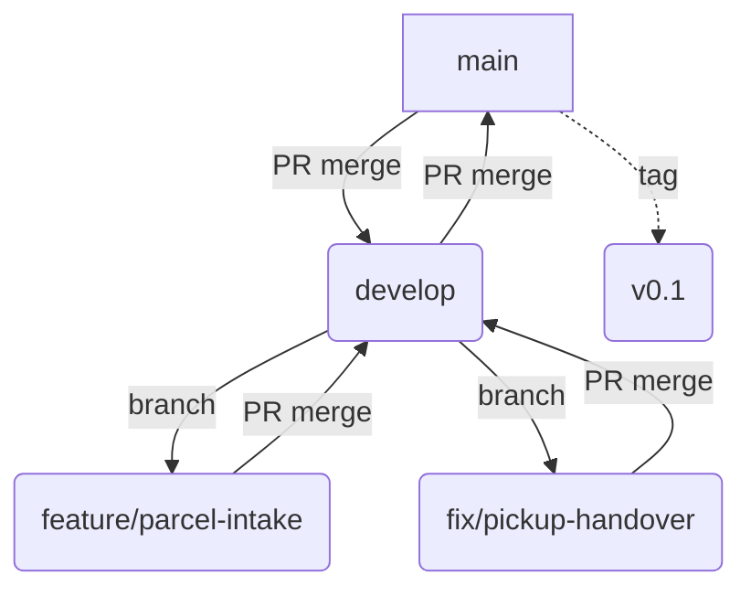

# CONTRIBUTING.md

This document defines the collaboration rules for COMP 3500SEF Group 23. All members must read and follow it before submitting code, documents, or diagrams. It covers branching strategy, commit messages, file naming, diagram numbering, pull requests, and weekly requirements.

---

## Getting started

### Environment setup

1. Clone the repository:

   ```bash
   git clone https://github.com/Django-coder6/3500SEF-Group23-Project-LMS.git
   cd 3500SEF-Group23-Project-LMS
   ```

2. Start the local environment with Docker:

   ```bash
   docker compose up -d
   ```

3. Make sure `develop` is up to date:

   ```bash
   git checkout develop
   git pull origin develop
   ```

### Branch model

| Branch | Purpose | Protection |
|---|---|---|
| `main` | Demo version. Only accepts PRs from `develop` or `hotfix/*`. | Protected |
| `develop` | Integration branch. Merge target for all working branches. | Protected |
| `feature/*` | New feature development. | No |
| `fix/*` | Bug fixes. | No |
| `docs/*` | Documentation changes. | No |
| `release/*` | Release preparation. | No |
| `hotfix/*` | Emergency fixes. Branched from `main`, merged back to `main` and `develop`. | No |

Always create working branches from the latest `develop`. Naming examples:

```
feature/parcel-intake-api
fix/pickup-handover-null-pointer
docs/update-risk-register
```

The following Mermaid diagram shows the branch flow. GitHub renders Mermaid code blocks automatically. If your local editor does not support Mermaid, please commit and push the file to GitHub to view the rendered diagram.



For complex UML or ER diagrams, use PlantUML or draw.io as described later. For simple flow or branch diagrams, Mermaid is recommended because it renders directly on GitHub.

---

## Commit messages

Commit message format:

```
<type>(<scope>): <subject> [TASK-ID]
```

- `type`: `feat`, `fix`, `docs`, `test`, `refactor`, `chore`, `style`
- `scope`: affected module, such as `backend`, `frontend`, `docs`, `api`
- `subject`: use English, start with a verb, use lower case, and do not end with a period
- `[TASK-ID]`: required, used to trace the commit back to a Backlog item or requirement

Examples:

```
feat(backend): add parcel intake endpoint [TASK-012]
fix(frontend): correct pickup form validation [TASK-034]
docs(requirements): update SRS section 3.2 [TASK-008]
```

---

## File and folder naming

Folders and file names are lower case, with words separated by a hyphen. Do not
use spaces.

- `test-cases-pickup.md`, not `Test Cases Pickup.md`
- `risk-register.md`, not `RiskRegister.md`
- `openapi.yaml`, not `Open API.yaml`

Documents that record something that happened on a particular day start with
that date in `YYYYMMDD` form, so that a folder listing sorts itself
chronologically:

```
docs/05-management/minutes/20261015_weekly-meeting.md
docs/01-requirements/elicitation/20261012_interview-resident.md
docs/01-requirements/elicitation/20261010_survey-results.xlsx
```

Personal logbooks follow a fixed pattern:

```
docs/06-logbook/YYYYMMDD_Name_Logbook.md
```

Diagram sources are kept as text, not as exported images, so that a change to a
diagram shows up as a readable diff in a pull request:

- PlantUML sources: `.puml`
- draw.io sources: `.drawio`
- Mermaid sources can be embedded directly in `.md` files
- Exported images used in the report go to `docs/07-report/figures/`

---

## Diagram numbering

Diagram titles describe the business scope instead of carrying a sequence
number, so a reader can tell what a diagram covers without looking anything up.
Put the scope in brackets:

- `Use Case Diagram(Staff Intake Parcel)`
- `Sequence Diagram(Resident Pickup Handover)`
- `Class Diagram(Parcel and Storage Location)`
- `ER Diagram(Collection Point Database)`
- `State Diagram(Parcel Lifecycle)`

For the report, figures and tables are numbered by chapter with a running
number inside that chapter:

- Figures: `Figure 4-1`, `Figure 4-2`, `Figure 6-1`
- Tables: `Table 3-1`, `Table 4-2`

A figure caption goes below the figure. A table caption goes above the table.
Every numbered figure and table has to be referred to at least once in the body
text, and the source file for every figure has to be committed under
`docs/02-design/`.

If you use Mermaid, the source is inside the `.md` file, so no separate source
file is needed, but you still need to number the figure in the report and
reference it in the text.

---

## Pull requests

### Workflow

1. Create a working branch from the latest `develop`.
2. Commit incrementally. Each commit should correspond to one explainable change.
3. Push to the remote.
4. Open a PR against `develop` (`hotfix/*` opens against `main`).
5. **Link the relevant Issues in the PR description** (e.g., `Closes #13`, `Fixes #14`). Remember to add the Issues before requesting a review.
6. At least one non-author member must approve, and CI must pass before merge.
7. Delete the working branch after merge.

### PR title and description

- Title format is the same as commit messages: `<type>(<scope>): <subject> [TASK-ID]`
- The description must include: change summary, **linked GitHub Issue numbers**, how it was tested, and screenshots or evidence links if UI or documents are involved.

**Example PR description:**

```
## Summary
Updated README, glossary, and document naming rules.

## Linked Issues
Closes #13
Closes #14

## Testing
- Verified all Markdown files render correctly on GitHub.
```

### Review requirements

- Reviewers must check: naming rules, diagram numbering, references to Backlog tasks, and whether tests cover the changes.
- The author must respond to review comments within 48 hours.

### Prohibited

- Do not push directly to `main` or `develop`.
- Do not merge an un-reviewed PR.
- Do not commit exported images as diagram source files.

---

## Weekly requirements

Every member must meet the following minimum requirements each week:

1. **At least two substantive commits**, with commit messages that follow the format above.
2. **Update your personal logbook**: under `docs/06-logbook/`, following `YYYYMMDD_Name_Logbook.md`, and push before **Sunday 21:00**.
3. **Record promptly**: write the log entry within **48 hours** after finishing work.
4. **Review at least one PR from another member**.

A log entry should include: task ID, description, time spent, status, evidence link (PR or commit), collaborators, and issues encountered with fixes.

---

## Week 1 Issues (Sprint 0)

Below are the specific WBS tasks assigned to each role during Week 1. Every member must link their PR to the relevant Issue before requesting a review.

### [T-00-02] Set up repository structure and branch protection
- **WBS task**: [T-00-02]
- **Requirement**: Set up repository structure and branch protection
- **Owner**: R10 (DevOps & Integration)
- **Sprint**: Sprint 0
- **Due**: Week 1
- **Status**: ✅ Closed

### [T-00-04] Create initial issues and project board
- **WBS task**: [T-00-04]
- **Requirement**: Create initial issues and project board
- **Owner**: R1 (Project Manager)
- **Sprint**: Sprint 0
- **Due**: Week 1
- **Status**: ✅ Closed

### [T-00-05] Team training on Git, branches and commit convention
- **WBS task**: [T-00-05]
- **Requirement**: Team training on Git, branches and commit convention
- **Owner**: R1 (Project Manager)
- **Sprint**: Sprint 0
- **Due**: Week 1
- **Status**: Open

### [T-00-06] Write README, glossary and document naming rules
- **WBS task**: [T-00-06]
- **Requirement**: Write README, glossary and document naming rules
- **Owner**: R9 (Documentation Specialist)
- **Sprint**: Sprint 0
- **Due**: Week 1
- **Status**: Open

### [T-10-01] Design and distribute the requirement survey
- **WBS task**: [T-10-01]
- **Requirement**: Design and distribute the requirement survey
- **Owner**: R3 (Requirements Analyst)
- **Sprint**: Sprint 0
- **Due**: Week 1
- **Status**: Open

### [T-10-02] Interview three real users and write up the notes
- **WBS task**: [T-10-02]
- **Requirement**: Interview three real users and write up the notes
- **Owner**: R3 (Requirements Analyst)
- **Sprint**: Sprint 0
- **Due**: Week 1
- **Status**: Open

### [T-10-03] Competitor analysis of parcel collection services
- **WBS task**: [T-10-03]
- **Requirement**: Competitor analysis of parcel collection services
- **Owner**: R2 (Product Owner)
- **Sprint**: Sprint 0
- **Due**: Week 1
- **Status**: Open

### [T-10-04] Build three personas and the user journey map
- **WBS task**: [T-10-04]
- **Requirement**: Build three personas and the user journey map
- **Owner**: R3 (Requirements Analyst)
- **Sprint**: Sprint 0
- **Due**: Week 1
- **Status**: Open

### [T-10-05] Draft SRS chapters 1 and 2
- **WBS task**: [T-10-05]
- **Requirement**: Draft SRS chapters 1 and 2
- **Owner**: R2 (Product Owner)
- **Sprint**: Sprint 0
- **Due**: Week 1
- **Status**: Open
- **Description**: See GitHub Issue #11 for detailed scope and acceptance criteria.

---

## Task Tracking Example

Below is an example of how a WBS task is recorded in an Issue:

> **WBS task**: [T-00-06]
> **Requirement**: Write README, glossary and document naming rules
> **Owner**: R9
> **Sprint**: Sprint 0
> **Due**: week 1

---

## Directory conventions

| Directory | Content | Owner |
|---|---|---|
| `docs/01-requirements/elicitation/` | Research and interview records | R2, R3 |
| `docs/01-requirements/specification/` | SRS, Backlog, RTM | R2, R3 |
| `docs/02-design/adr/` | Architecture decision records | R4, R6 |
| `docs/02-design/database/` | Database design | R6 |
| `docs/02-design/uml/` | UML sources (`.puml` / `.drawio`) | R4, R6 |
| `docs/03-api/` | OpenAPI specification (`openapi.yaml`) | R6 |
| `docs/04-testing/test-cases/` | Test cases | R8 |
| `docs/04-testing/reports/` | Test reports | R8 |
| `docs/05-management/minutes/` | Meeting minutes | R1 |
| `docs/05-management/plans/` | Plans | R1 |
| `docs/05-management/weekly/` | Weekly reports | R1 |
| `docs/06-logbook/` | Personal logbooks | All members |
| `docs/07-report/` | Report chapters | R9, R1 |
| `docs/07-report/figures/` | Exported figures for the report | R9, R1 |

---

## Questions

If you have questions about these rules, please ask in the team chat. R1 (Project Manager) or R10 (DevOps & Integration) will make the final decision. Changes to this document require a PR and review by at least one other member before merge.
