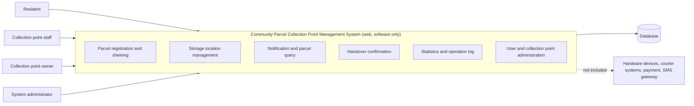

# Software Requirements Specification (SRS)

## Community Parcel Collection Point Management System

| Item | Detail |
|---|---|
| Document ID | SRS |
| Task | T-10-05 |
| Version | v0.1 (draft, Chapters 1 and 2 only) |
| Author | R2 |
| Status | Draft, pending team review |
| Related documents | [personas.md](../elicitation/personas.md), [user-journey-maps.md](../elicitation/user-journey-maps.md) |

## Table of Contents

- [1. Introduction](#1-introduction)
- [2. Overall Description](#2-overall-description)

---

## 1. Introduction

### 1.1 Purpose

This document specifies the software requirements for the Community Parcel Collection Point Management System. It is intended for the project team, the course instructor, and future testers. Chapters 1 and 2 define the background, problem, goals, scope, and overall context. Later chapters (functional requirements, non-functional requirements, and so on) will be added in later weeks.

### 1.2 Background

Online shopping has made parcel delivery a daily activity in residential communities. Couriers often deliver parcels in bulk to a nearby **collection point** (for example, a convenience store or a community service room), where staff keep the parcels until residents pick them up. Existing platforms and apps exist in this market, and the team is analysing three of them in the competitor analysis (T-10-03).

Many small collection points still rely on manual registration, paper notebooks, and informal communication. As parcel volume grows, this causes errors, delays, and disputes.

### 1.3 Problem Statement

| # | Problem | Affected role |
|---|---|---|
| P1 | Residents do not receive timely or clear notification of arrival and cannot tell where their parcel is. | Resident |
| P2 | Queues and long waits at the collection point during peak hours. | Resident, Staff |
| P3 | Manual registration and shelving of large batches is slow and error-prone. | Staff |
| P4 | Searching for a parcel on crowded shelves wastes time. | Staff, Resident |
| P5 | Wrong-person handovers and unprovable lost-parcel claims, because there is no reliable handling record. | All roles |
| P6 | The owner has no real-time statistics on volume, overdue parcels, or staff activity. | Owner |

### 1.4 Goals

| ID | Goal |
|---|---|
| G1 | Give residents timely visibility of their parcels, including status, storage location, and pickup code. |
| G2 | Reduce the time staff need for **shelving** and **handover** compared with the manual process. |
| G3 | Keep an accurate, traceable record of every parcel from arrival to handover. |
| G4 | Provide the owner with simple statistics and overdue-parcel monitoring. |
| G5 | Provide role-based access so each user only sees what they need. |
| G6 | Deliver a usable web system within the 16-week course schedule. |

> Quantified targets (for example, handover time and notification delay) will be defined in the non-functional requirements chapter after survey data from R3 is available.

### 1.5 Scope

#### 1.5.1 Important clarification

> **This system is a pure-software web system and does not involve any hardware device control.**

#### 1.5.2 In Scope

| ID | Item |
|---|---|
| IS-1 | User registration, login, and role-based access control for four roles. |
| IS-2 | Registration of incoming parcels (single and batch) at a collection point. |
| IS-3 | **Shelving** workflow: assigning each parcel to a **storage location** and recording it. |
| IS-4 | Management of storage locations (create, edit, disable). |
| IS-5 | Notification to residents when a parcel is shelved (in-system notification). |
| IS-6 | Parcel query and status tracking for residents and staff. |
| IS-7 | **Handover** workflow: verifying a pickup code or identity and confirming handover. |
| IS-8 | Handling of exceptions: overdue, returned, or problem parcels. |
| IS-9 | Operation log for every parcel and staff action. |
| IS-10 | Statistics and overdue-parcel reports for owners. |
| IS-11 | Collection point and staff account management. |
| IS-12 | System administration (users, collection points, basic configuration). |

#### 1.5.3 Out of Scope

| ID | Item | Reason |
|---|---|---|
| OS-1 | Control of any hardware device, including scanners, printers, door access, or any other physical equipment. | The system is software only. |
| OS-2 | Courier and logistics functions such as route planning, dispatching, and delivery tracking before arrival at the collection point. | Handled by courier companies. |
| OS-3 | Online payment, billing, and settlement of handling fees. | Beyond the course timeline. |
| OS-4 | Native mobile apps for iOS or Android. | The system is a web application only (responsive browser access). |
| OS-5 | Integration with real third-party courier or e-commerce systems. | Only simulated or manually entered data is used. |
| OS-6 | Real SMS or telecom gateway integration. | Notifications are in-system only in this version. |
| OS-7 | Advanced analytics, AI-based forecasting, or recommendation features. | Beyond the course timeline. |

### 1.6 Definitions, Acronyms, and Terminology

The following project terms must be used consistently in all documents and code.

| Term | Definition |
|---|---|
| Collection point | A physical place where parcels are received, kept, and handed over to residents. |
| Storage location | A specific shelf position at a collection point where a parcel is placed. |
| Shelving | The process of receiving a parcel, registering it, and placing it at a storage location. |
| Handover | The process of confirming that a parcel has been delivered to the correct resident. |
| Parcel | An item sent to a resident that is held at a collection point. |
| Pickup code | A code given to the resident, used to verify the handover. |
| SRS | Software Requirements Specification. |

### 1.7 References

| Ref | Document |
|---|---|
| [R1] | Course brief and Week 1 announcements, 3500SEF Group 23 |
| [R2] | Personas (`docs/01-requirements/elicitation/personas.md`) |
| [R3] | User Journey Maps (`docs/01-requirements/elicitation/user-journey-maps.md`) |
| [R4] | Interview records and competitor analysis (`docs/01-requirements/elicitation/`, by R3) |
| [R5] | IEEE Std 830 / ISO/IEC/IEEE 29148, used as SRS structure guidance |

---

## 2. Overall Description

### 2.1 Product Perspective

The system is a new, standalone web application. It does not replace any existing system and does not depend on external platforms in this version. Users access it through a modern web browser on desktop or mobile.

### 2.2 Product Functions (Summary)

| Function area | Summary |
|---|---|
| Account and access | Registration, login, role-based permissions |
| Parcel registration | Single and batch registration of incoming parcels |
| Shelving | Assign parcels to storage locations and update status |
| Notification | Notify residents when parcels are ready |
| Search and tracking | Find parcels by code, phone number, or status |
| Handover | Verify code or identity and confirm handover |
| Exception handling | Manage overdue, returned, and problem parcels |
| Reporting | Volume statistics and overdue-parcel lists |
| Audit | Operation log of all parcel-related actions |
| Administration | Manage collection points, staff, and configuration |

Detailed functional requirements will be written in Chapter 3.

### 2.3 User Roles

The system has four user roles.

| Role | Description | Persona | Main permissions |
|---|---|---|---|
| Resident | A person living near a collection point who receives parcels. | Emily Chen | View own parcels, status, storage location, and pickup code; receive notifications. |
| Collection point staff | An employee who handles parcels at a collection point. | Daniel Wu | Register parcels, perform shelving, search parcels, confirm handover, handle exceptions. |
| Collection point owner | The person responsible for one or more collection points. | Linda Zhang | View statistics and overdue parcels, review operation logs, manage staff accounts for own collection points. |
| System administrator | A technical user who maintains the system. | None (technical role) | Manage all users, collection points, and system configuration. |

### 2.4 System Boundary

| Boundary element | Inside the system | Outside the system |
|---|---|---|
| Users | The four roles above interact via a web browser | Couriers have no direct system role in this version |
| Data | Parcel, storage location, user, and log data stored in the system database | Data in courier or e-commerce platforms |
| Devices | Standard user devices running a web browser | **Any hardware device control** (the system is pure software) |
| Services | In-system notifications | Payment, SMS, and third-party integrations |

### 2.5 Operating Environment

| Item | Description |
|---|---|
| Client | Current versions of Chrome, Edge, Firefox, and Safari on desktop and mobile |
| Server | Web server and relational database (final technology stack to be decided by the team) |
| Network | Internet or local network access is required |
| Repository | GitHub, with CI pipeline set up by R10 |

### 2.6 Design and Implementation Constraints

- The project must be completed within the 16-week course schedule (Week 1 to Week 16).
- The system is a web application only; no hardware device control is allowed.
- All documents and code must follow the project terminology in Section 1.6.
- All work must follow the team's GitHub workflow in `CONTRIBUTING.md` (feature branches, pull requests into `develop`, review before merge).
- User data must be handled according to basic privacy practices, for example by not storing unnecessary personal information.

### 2.7 Assumptions and Dependencies

| ID | Assumption or dependency |
|---|---|
| A1 | Staff enter or import parcel data manually because no real courier integration exists. |
| A2 | Each resident has a phone number or account that can be used to identify them. |
| A3 | Staff and residents have access to a device with a web browser and an internet connection. |
| A4 | The personas and journey maps are AI-simulated and will be validated against R3's survey and interview results. |
| A5 | The technology stack and deployment environment will be agreed by the team in a later week. |

### 2.8 Open Issues (To Be Resolved with R3)

| ID | Issue |
|---|---|
| OI-1 | Confirm the most common identification method for handover (pickup code, phone number, or both) from interviews. |
| OI-2 | Confirm whether owners also need to act as staff in small collection points. |
| OI-3 | Confirm overdue-parcel rules (number of days, handling method) with real collection point owners. |
